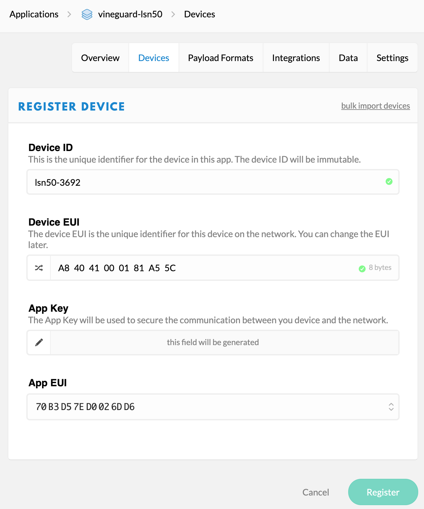
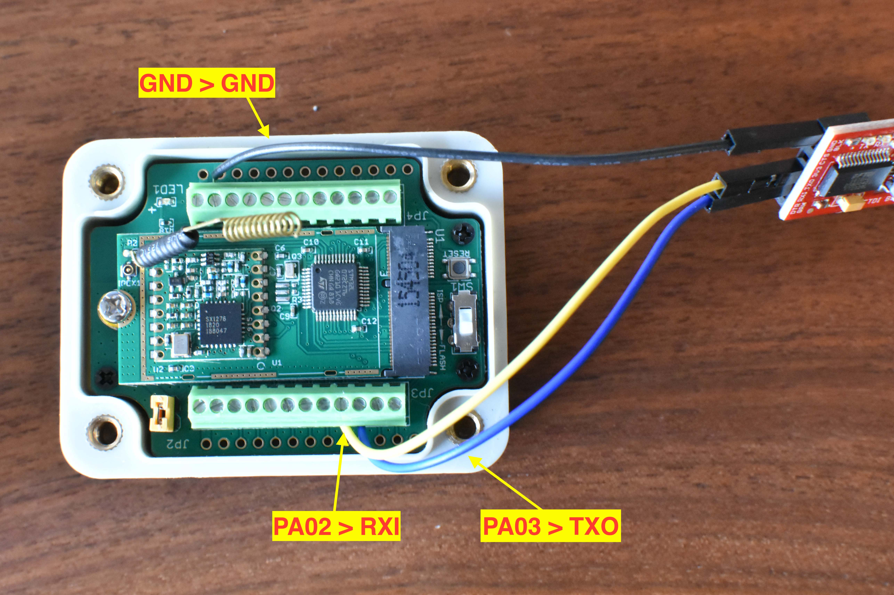
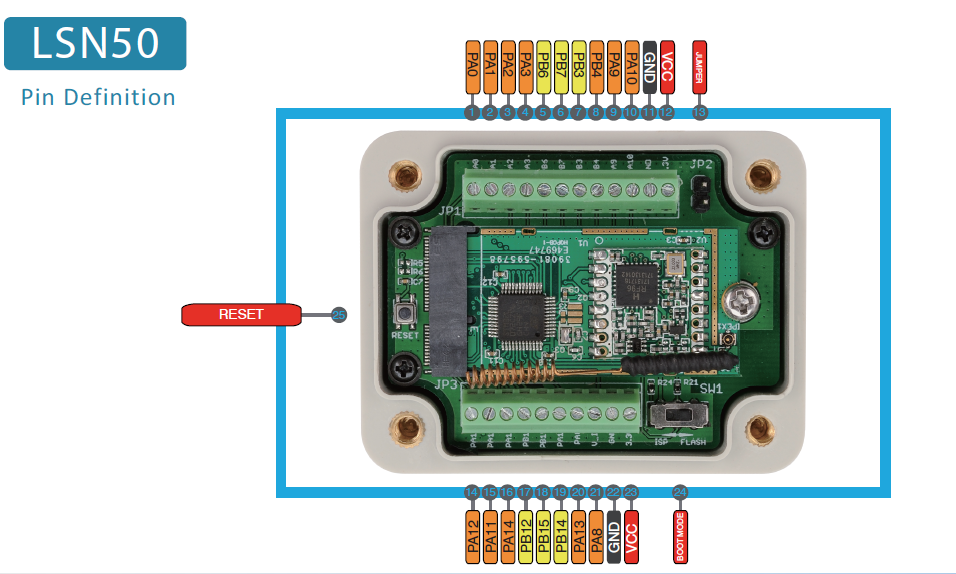
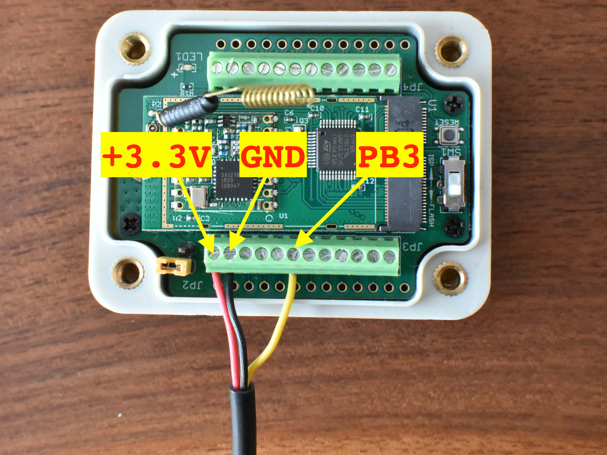
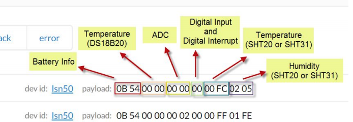

# Setup for the LSN50 LoRa module
Information on the LSN50 device can be found on [this webpage](https://wiki.dragino.com/index.php?title=Lora_Sensor_Node-LSN50).
The device user manual is available in PDF format in this directory.

The contents of the above references encompases those steps summarized below.

## Register device with The Things Network
The Things Network (TTN) is a service provider for LoRa.
This assumes you have already set up an application in your TTN account.
In this case, we have created an application called "vineguard-lsn50" for pipelining data from all of our LSN50 LoRa sensor devices.

To register a new device, TTN and your device need to share 3 pieces of information.
1. a device EUI
2. an application EUI
3. an application KEY

The LSN50 device comes pre-configured with these three values.
When registering the device with TTN, you can specify these three values as part of the "register device" process.
They are available on the label of the LSN50 box.

If you chose to use all the preconfigured values, then you will first need to go to `Application>your_app_name>Settings`.
Under the sidebar options, click `EUIs`. 
Then chose `add eui`, and manually enter the APPEUI from LSN50 box label.

If you want to let TTN use its own application EUI and application KEY, you can skip the above step.
Later, however, you'll need to follow the AT command programming steps below, in order to write the new APPEUI and APPKEY to the device.

In both cases, you'll still need to proceed to `Applications>your_app_name>Devices`, click "register device".


Here, I have given the DeviceID field the construct `lsn50-<SerialNumber>`, where the serial number is available on the box.
This can be any unique name you chose.

Next, enter the device EUID.
Next, if you want to use the device's preconfigured App Key, then transcribe the App Key.  Otherwise let TTN autogenerate a key.
If you are using the preconfigured App Key, then you will also want to use the preconfigured App EUI.
If you followed the instructions above and added the App EUI in the Application Settings, 
then the App EUI should be available in the dropdown menu of the App EUI field.

## Program via AT commands
First, connect the device to a USB-UART converter (e.g. [Sparkfun 3.3v FTDI Basic](https://www.sparkfun.com/products/9873)).
Connect GND, RXI and TXO as in this image:




Next, power on the device by connecting the jumper (JP2).
With the converter connected to a computer, open a serial terminal. 
I like to use the Serial terminal in the Arduino IDE.
Navigate to `Tools>Port` and select the device matching your USB-UART converter.
Open a Serial terminal, and set the baud rate to 9600.
You should see the device's data reporting to the terminal.
If not, press the "RESET" button on the LSN50 device.

Next, you will need to set the `APPKEY` and the `APPEUI`.
These values were auto-generated by The Things Network (TTN)  when the device was registered.
The device comes configured with a default `APPKEY` and `APPEUI`, but unfortunately we can't use these with TTN.

To interact with the device, you will use AT commands.
You can view a full list of the AT commands by sending `AT?` to the device via the serial terminal.
A printout like this should result:


As mentioned above, you need to set the `APPKEY` and the `APPEUI` fields.
This can be accomplished with the `AT+APPKEY=<value>` and `AT+APPEUI=<value>` commands, respectively.
Once set, they can be verified with the `AT+APPKEY=?` and `AT+APPEUI=?` commands, respectively.

Note that the format of the `value` is a string, with spaces delimiting each hex value.
e.g. `AT+APPEUI=70 B3 D5 7E D0 02 6D D6`

When done, push the "RESET" button on the device.

The device should connect to TTN within a few minutes (of course, assuming it is within range of a TTN gateway). 
On the TTN "Device Overview" page for the specific device, the indicator under "Status" should show green after communication is established.

## Wiring the DS18B20 temperature probe 
The temperature probe is wired in to the LSN50 as per the above webpage.
It is best practice to power-off the device (open the jumper) before wiring in the sensor.
Here is a better annotated photo of how the sensor is connected to the LSN50 pinout:


## Parsing data payload
The data payload of the LSN50 (using the default firmware) consists of the following fields:


To have TTN automatically parse and transform the "Temperature (DS18B20)" field, 
add the following javascript function to the "Payload Formats" section.

```javascript
function Decoder(bytes, port) {
var value=bytes[0]<<8 | bytes[1];
var batV=value/1000; // battery voltage [V]

value=bytes[2]<<8 | bytes[3];
if(bytes[2] & 0x80) {
  value |= 0xFFFF0000;
}
var tempc=(value/10).toFixed(2); // DS18B20 temp [degC]

value=bytes[7]<<8 | bytes[8];
if(bytes[7] & 0x80) {
  value |= 0xFFFF0000;
}

return {
  BatV:batV,
  TempC:tempc
};
}
```

## Data Storage integration
TTN offers a free data storage integration (which will hold a 7 day history).
To activate the integration, navigate to `Applications>my_app_name>Integrations`.
Select and activate the Data Storage integration.
All data captured by your Application will now funnel in to Storage, and is accessible via a RESTful endpoint.
