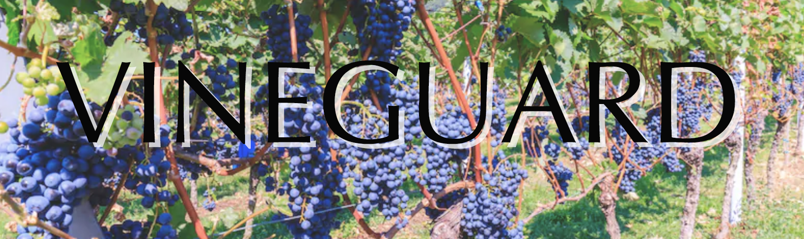

***

#### <u>Vineguard</u>: Don't let frost destroy your crop. Get alerts before it happens.

Vineyards.

Vineyards grow one of the most valuable, and expensive, crops around.
As you can imagine, protecting each season's crop is critically important.
One of the most significant risks facing a crop is the risk of frost.
If temperatures drop below freezing on a wintery evening, an entire harvest can be lost.

If a vineyard manager anticipates a frost event, they take protective measures to protect their crop.
Typical methods include turning on large fans to mix up the cold air settling in a field, or straight-up lighting propane heaters.
Another common method is to turn on large water sprayers, which keep a steady flow of water spraying on the fruit
(the [latent heat](https://en.wikipedia.org/wiki/Latent_heat) of the water keeps the grapes from freezing).

In all cases, the vineyard manager must be on alert for frosting events.

Large vineyards have started to adopt suites of sensors for monitoring their vineyards 
(for far more agro-intelligence than simply monitoring temperature and frost).
All this part of the growing space of big "Ag Tech".

Smaller vineyards, however, still use a crazy-obsolete 1950's technology to monitor for frost events.
At a single point in the vineyard deemed to be the coldest, there is a post with a traditional thermometer.
The thermometer has a mercury switch which triggers when the thermometer drops near freezing.
The mercury switch is wired in to a phone (!) line, and tied to a call-center with operators
(this is typically an add-on service to, say, a traditional burglary/home-alert system).
When the mercury switch is triggered, it sends an alert to the call-center operators, 
who in turn call the phone of the vineyard manager.

It would seem at first hearing this that this system is ripe for disruption!

Can we make this system ...  
Less expensive?  
More reliable?  
A better user experience?  

Could we displace this system with one that provides an extensible foundation for other insight and value extraction?

---

Larger vineyards that have already adopted a sophisticated AgTech solution are likely our target.
They have likely already moved on from the above-mentioned old-school tech.

Those smaller vineyards that still use the old-school method have two types of vineyard managers
(our target customer persona, or, at least, our user).  
*There is the older generation.*  The generation that prides itself on intuiting things about the grapes that no sensors could ever measure.
They are likely not adopters of a solution to displace the status quo.  Or, at least, not anywhere near our early or near-term adopters.  
*There is the younger generation.*  This generation of managers is engaged in innovation.  
They aren't entrenched in old practices, but are open to technology that could ameliorate their experience, or provide recognizable and unprecedented value-add.
These are our target users.  
*There's also the tech-loving head-honchoes...*  Maybe there's a play here for Boutique and semi-custom sensor deployment and monitoring.

---

Alas, this is an intriguing proposition to entertain.  
And here's a cut at some functionality which may transform in to minimal product for an early adopter.
